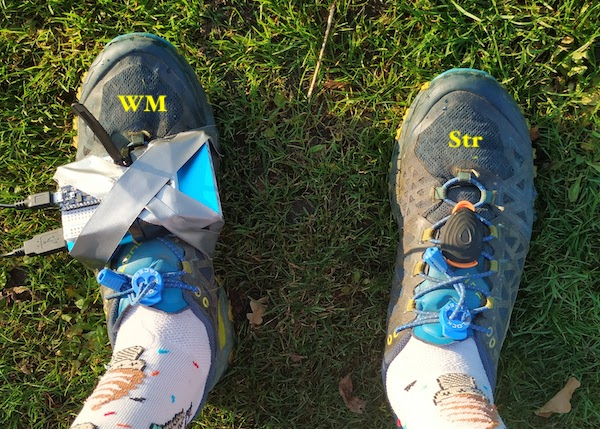
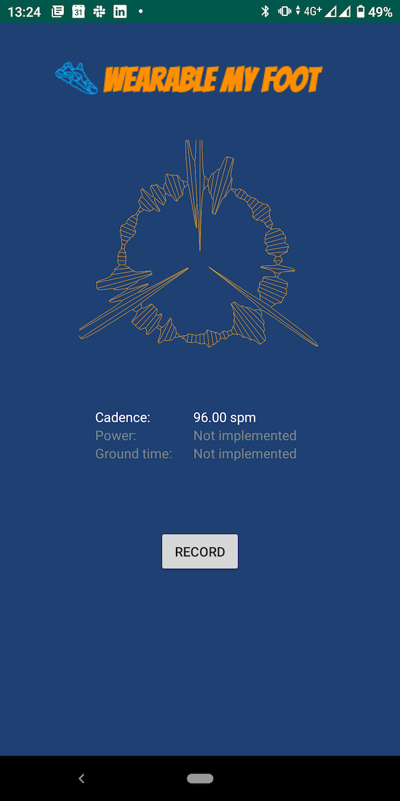

# Wearable My Foot

Powered by [Fuzzy Labs](https://fuzzylabs.ai). Formerly known as 'AI-for-your-feet'.

Wearable [My Foot](https://en.wiktionary.org/wiki/my_foot) (WMF) is an Open Source wearables project built on Arduino.

The primary aim is to try and replicate a 'running power' metric similar to that produced by state of the art commercial products such as [Stryd](https://www.stryd.com/). We're using the gyroscope and accelerometer built into the Arduino along with some clever maths in order to produce an estimation of running power.

[Future ideas](future-ideas) include attaching a pressure sensitive insole to the device and tracking things such as gait and posture.

The project covers:

* Building the physical hardware.
* Writing and deploying the firmware to the hardware.
* Gathering gyroscope and accelerometer data from the hardware.
* The algorithm(s) used to transform that data into useful metrics (running power, step counter, ground time, etc.)
* An Android app that pairs with the hardware and displays the metrics in realtime.

## Hardware



The hardware is based on an [Arduino Nano IOT microcontroller](https://store.arduino.cc/arduino-nano-33-iot).

n.b. the current generation of hardware is a prototype. Future iterations will have a better form-factor by using smaller components. Example product links are included for purchasing the components.

* 1 breadboard: https://www.amazon.co.uk/ELEGOO-Breadboard-Solderless-Distribution-Connecting/dp/B01M0QJTI5
* Arduino Nano IOT microcontroller: https://www.amazon.co.uk/Arduino-Nano-IoT-headers-mounted/dp/B07WPFQZQ1/
* TODO: battery stuff

## Microcontroller code

The [firmware code](firmware) for the Arduino is built using PlatformIO.

### Optional Virtualenv setup

Feel free to skip if you're installing / have installed PlatformIO using a different method. To initialise the environment using Python 3 and `pip`:

```
python -m venv env
env/bin/activate
pip install -r requirements.txt
```

To activate the environment, `source env/bin/activate`.

### Building and deploying to the device

To *Just build*

```
platformio run
```

*Build and upload*

```
platformio run -t upload
```

*Attach a serial monitor*

```
platformio run -t monitor
```

*Run the tests* - this builds a new image and uploads it so that tests are run on the device

```
platformio test
```

## Android app

The Android app allows the device to connect via Bluetooth and upload data. It's written in [Kotlin](https://kotlinlang.org).



### Building and deploying via Android Studio

0. Enable the development mode on your Android device, and connect the device with a USB cable
1. Clone or download the repository code
2. Open the project in Android Studio (File > Open)
3. Run the app (Shift+F10 or Run > Run 'app'), this might display a prompt on the Android device to confirm that you trust the computer (if it is not on the trusted list yet)

### Screen sharing Android device on linx

TODO (scrcpy)

### Usage
0. Have the Arduino powered on
1. Open the app. The app will request access to location data, which is required for Bluetooth scanning.
2. Tap 'Scan' to scan for BLE devices, if the compatible device is found, its MAC address will be displayed on the screen.
3. Tap 'Connect' to connect to the Arduino. After successful connection, the orange LED will light up on the Arduino, and current readings will be displayed on the screen.
4. Tap 'Disconnect' to disconnect and end the session.
5. Tap 'Save' to save the results of the session into a CSV file (saved at `Android/data/ai.fuzzylabs.wearablemyfoot/files/` on the Android device

## Jupyter notebooks

The [notebooks](notebooks) directory contains notebooks with code used in the experiments

* powermetre.ipynb -- the notebook for estimating the power of a walk in a straight path. Requires three CSV files
  - Measurements of acceleration when the device is at rest for calibration (provided at [data/still.csv](data/still.csv)
  - Measurements of acceleration during a walk with the Arduino mounted on a chest (can be recorded with the provided app, and the sample data is provided at [data/chest3.csv](data/chest3.csv)
  - Measurements of acceleration during a walk taken with the Android device for comparison (provided at [data/chest-android.csv](data/chest-android.csv)

### Versioning the notebooks

See [here](https://nextjournal.com/schmudde/how-to-version-control-jupyter) for a nice description of the problems associated with versioning Jupyter notebooks and some suggested solutions.

We're using [nbstripout](https://github.com/kynan/nbstripout) to remove the outputs and state data from the committed versions of our notebooks.

```
nbstripout --install
nbstripout --install --attributes .gitattributes
nbstripout --install --global
nbstripout --status
```

## Results
### Cadence
Mean average cadence (in steps per minute) recorded with different methods:
Test case|Stryd|Garmin|(WMF) Peak Detection|(WMF) FFT|(WMF) Autocorrelation
|:---|---:|---:|---:|---:|---:|
1km mixed run| 82.56| 82.48| 71.50| 170.17| 154.48

## Data

The [data](data) directory contains some example data generated by the device.

### Power measurements
Several sample CSV files containing IMU measurements (acceleration and angular velocity)
* `still.csv` -- several minutes of the devices sitting still on a table; used to assess the accuracy and the bias of the IMU
* `leg.csv` -- a short walk with the device strapped to a side of a leg
* `chest3.csv` -- a short walk (4.5 metres) with the device attached to a chest
* `chest-android.csv` -- a short walk (4.5 metres) recorded with an Android phone (at the same time as `chest3.csv`) 

## Data dashboard (Dash)

The [dash](dash) directory contains a dashboard generated by the [Dash](https://plotly.com/dash) framework. Dash is Python-based, and uses the [Flask](https://flask.palletsprojects.com) web framework; Dash is similar to [R-Shiny](https://shiny.rstudio.com).

### Running locally

```
pip install -r requirements.txt
```

```
python app.py
```

### Modification

* For a guide to Plot.ly graphs etc, see [here](https://plotly.com/python).

## Other wearable feet things

### Commercial Pressure Sensing Insoles

* [Nurvv](https://www.nurvv.com/en-gb/) - aimed at runners but [this one doesn't like it](https://www.youtube.com/watch?v=bdbcMtIYq24)
* [Arion](https://www.arion.run/) - aimed at runners
* [Digitsole](https://www.digitsole.com/) - running / cycling / health
* [Retisense](https://retisense.com/) - aimed at gait analysis / physio tool
* [Salted](https://www.salted.ltd/insole) - aimed at golfers

### Open Source / DIY Pressure Sensing Insoles

TODO

### Commercial Foot Pods

* [Stryd](https://www.stryd.com/) - Running power meter, they are [quite opaque](https://support.stryd.com/hc/en-us/articles/115003992194-How-Does-Stryd-Measure-Power-) about how it works although it seems to generally get good reviews.
* [RunScribe](https://runscribe.com) - Measures gait, power and others. [More transparent](https://runscribe.com/power/) than Stryd on how they calculate running power.
* [Garmin Running Dynamics Pod](https://buy.garmin.com/en-GB/GB/p/561205) - Measures cadence, stride length etc, can also do power when used with other Garmin devices. [DC Rainmaker review](https://www.dcrainmaker.com/2017/12/garmin-running-power-good.html)
* [Coros](https://www.coros.com/pod.php) - Running power and other metrics

### Open Source / DIY Foot Pods

TODO

### Running Power

* [George Ron on the Physics](http://www.georgeron.com/2017/09/the-physics-of-running-power.html)
* [George Ron on Stryd](http://www.georgeron.com/2017/12/stryd-running-power-model.html)
* [George Ron on RunScribe (GOVSS)](http://www.georgeron.com/2017/11/the-govss-running-power-algorithm-and.html)
* [Difference between Running and Cycling Power](https://www.trainingpeaks.com/blog/the-differences-between-running-and-cycling-power/)
* [Running Power meters compared by Outside Online](https://www.outsideonline.com/2413011/running-power-meter-comparison-study) - interesting references to VO2 measurements.
* [Running Power meters compared by DC Rainmaker](https://www.dcrainmaker.com/2017/12/garmin-running-power-good.html) - focussed initially on Garmin but interesting comparisons with Stryd and RunScribe.
* [Running Power meters compared by Sport Tracks](https://sporttracks.mobi/blog/how-to-choose-a-running-power-meter)
* [Polar measure running power using only their smart watch](https://www.polar.com/uk-en/smart-coaching/running-power) - no need for a foot pod. Uses their "proprietary algorithm and it is based on your speed and altitude gradient"
